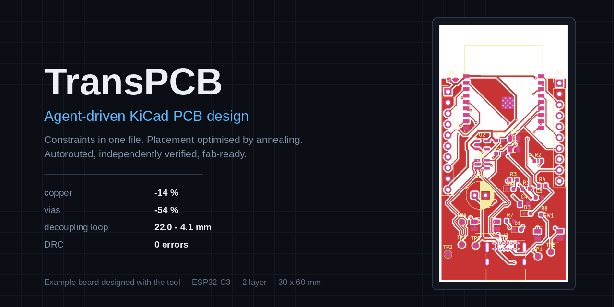

# TransPCB

Agent-driven KiCad PCB design. You describe the board; Claude does schematic
capture, placement, autorouting and verification — under constraints you declare
once in a file.

Built by working a real board end to end, and hardened against every way that
went wrong. The [gotchas](docs/gotchas.md) are the actual value here: eight
documented failures that no upstream tool warns you about, three of which were
live on a board while KiCad DRC reported **zero errors**.



## What you get

- **7 Claude skills** — from-scratch design, routing, verification, optimisation,
  fab output, and the constraint system that ties them together
- **A constraint spec** — fab limits, net classes, differential pairs, via
  budgets, impedance targets, RF keepouts — declared once, pushed down to the
  autorouter, KiCad's rules, and the verifier
- **A verification suite** that catches what DRC misses: board-vs-schematic net
  drift, copper in RF keepouts, pair skew and via asymmetry, drill/annular DFM,
  missing ground planes, design-rule tampering
- **A crash guard** for a KiCad 10.0.5 segfault that kills the app mid-session
- **A placement critic** that reads your netlist and scores decoupling distance,
  decap ordering, connector edge access, crystal proximity and keepouts — with
  thresholds that tighten by frequency band
- **A placement optimiser** — simulated annealing against a tunable cost
  function. On the example board it cut copper 772→665 mm and vias 92→39
  against a hand-tuned layout
- **Current-aware track widths** (IPC-2221) and a stackup gate, so an impedance
  target either uses your real stack or refuses to run
- **A fab package** gated on clean DRC — gerbers, drill, BOM, JLCPCB CPL
- **A worked example** — ESP32-C3 dev board, with its routing animation

## Install

```bash
git clone https://github.com/Karasik777/TransPCB && cd TransPCB
./setup/install.sh --project /path/to/your/board
```

Installs pinned versions of [`kicad-mcp-pro`](https://github.com/oaslananka/kicad-mcp-pro),
[`KiCadRoutingTools`](https://github.com/drandyhaas/KiCadRoutingTools), the
Freerouting container and the Python deps, then links the skills into
`~/.claude/skills/`. Nothing is vendored — upstream keeps its own updates.

Needs KiCad 9 or 10, `uv`, and optionally Docker. See [docs/mcp-setup.md](docs/mcp-setup.md).

## Use

```bash
cp constraints/example.yaml myboard/constraints.yaml    # edit it
```

Then just ask:

> Build me an ESP32-C3 dev board: USB-C power and native USB data, an efficient
> LDO, ESD protection, buttons, GPIO headers, test points. JLCPCB standard,
> 2 layers, as small as you can.

or, on a board that already exists:

> Route this board. Keep vias under 60, USB as a matched pair, ground plane on
> both layers, nothing under the antenna.

Anything after the verb belongs in `constraints.yaml` — say it once there and it
reaches the router, KiCad's rules and the verifier together.

## The loop

```
preflight  ->  commit  ->  apply constraints  ->  act  ->  verify  ->  commit
```

`git commit` before every routing run is not optional. Both autorouters and an
open pcbnew window have each silently destroyed a complete routing pass.

## Routers

| | Freerouting 2.1.0 | Rust A* |
|---|---|---|
| Routing violations | 1 unconnected, 2 dangling stubs | **0** |
| Copper | 958.3 mm | **691.7 mm** |
| Vias | **17** | 41 |
| Runtime | minutes | **0.18 s** |
| Workflow | 2 manual GUI steps | none — reads `.kicad_pcb` |

Rust A* is the default. It also rewrites your design rules and discards copper
zones, so the workflow repairs both after every run — see
[pcb-route](skills/pcb-route/SKILL.md).

## Layout

```
skills/       Claude skills — the automation surface
scripts/
  kicad_sexp.py        s-expression reader/writer everything else builds on
  apply_constraints.py spec -> KiCad rules + router flags + IPC-2221 widths
  verify.py            net sync, keepouts, pair skew, DFM, planes, rule drift
  place_rules.py       placement critic, band-aware EE guidelines
  place_optimise.py    simulated-annealing placement refinement
  probe_footprint.py   pad axis, origin, courtyard, mating face — before placing
  fill_zones.py        headless zone fill (kicad-cli has none)
  fab_package.py       gerbers/drill/BOM/CPL, gated on clean DRC
  preflight.sh         crash guard + stale-buffer guard
constraints/  the spec schema, documented inline
docs/         MCP setup, gotchas, workflow
setup/        pinned installer, versions.lock
examples/     ESP32-C3 dev board + routing animation
```

## Credits

- [kicad-mcp-pro](https://github.com/oaslananka/kicad-mcp-pro) — Osman Aslan (MIT)
- [KiCadRoutingTools](https://github.com/drandyhaas/KiCadRoutingTools) — drandyhaas (MIT)
- [Freerouting](https://github.com/freerouting/freerouting) (GPL)
- [KiCad](https://kicad.org)

MIT. See [LICENSE](LICENSE).
