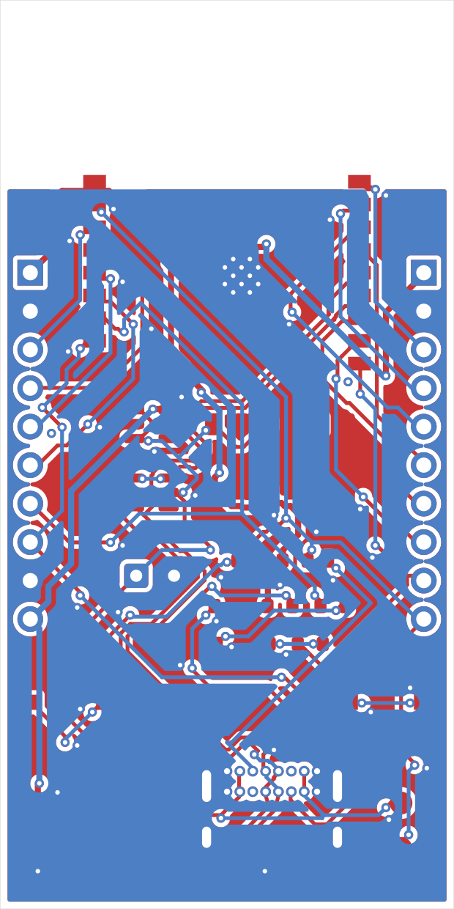

# ESP32-C3 dev board

The board TransPCB was built while making. 2 layers, 30 x 60 mm, JLCPCB standard.



## What's on it

- **U1** ESP32-C3-WROOM-02, antenna at the top board edge with a copper keepout
- **J3** USB-C, right-angle through-hole (GCT USB4085), 5.1k CC pulldowns
- **U3** USBLC6-2SC6 ESD clamp on D+/D- and VBUS
- **U2** AP2112K-3.3 LDO; CP1 100uF radial bulk, C4/C5 in, C6/C7 out
- Native USB Serial/JTAG on IO18/IO19 - **no UART bridge chip**
- RESET and BOOT buttons, power LED plus two user LEDs, six test points
- **J1/J2** 1x10 headers, pinout matched to the module's pin geography

## Header pinout

Deliberately arranged so each header carries the module pins physically nearest
it. Getting this wrong forces nets across the whole board and makes a 2-layer
route impossible without cutting the ground plane.

| J1 (left) | J2 (right) |
|---|---|
| 1 +3V3 · 2 GND | 1 +3V3 · 2 GND |
| 3 IO4 · 4 IO5 · 5 IO6 · 6 IO7 | 3 IO0 · 4 IO1 · 5 IO2 · 6 IO3 |
| 7 IO8 · 8 IO9 | 7 IO21/TX · 8 IO20/RX · 9 IO10 |
| 9 GND · 10 +3V3 | 10 EN |

## Reproducing

```bash
cp -r examples/esp32c3-devboard /tmp/demo && cd /tmp/demo
../../scripts/preflight.sh beautiful.kicad_pcb
python ../../scripts/verify.py beautiful.kicad_pcb --spec constraints.yaml --sch beautiful.kicad_sch
```

## Routing animation

`media/routing.gif` - 46 frames replaying the router's own event log
(`KICAD_ROUTE_TRACE=1`), showing traces laid, ripped and restored. Open it in a
browser; some image viewers show only the first frame.

## State

**0 DRC errors, 0 unconnected pads.** 5 of 6 TransPCB checks pass.

Routed with the two-stage flow - `route_diff.py` for the USB pair first, then
`route.py` for the rest. Pair skew: connector side 7.39 -> 3.26 mm, MCU side
13.42 -> 5.16 mm against a single-ended first attempt.

A board-level `ANTENNA_KEEPOUT` zone (tracks, vias and pour not allowed) keeps
the RF region clear - the router respects it, rather than the verifier catching
intrusions afterwards. Its boundary is y=61.5 rather than the footprint's 61.9,
because U1's own pads sit at y=62.0 and a 0.4 mm track reaching them spans
61.8..62.2.

### The one accepted failure

`diffpair:USB` - `USB_DM` carries 3 vias to `USB_DP`'s 0. Asymmetric vias convert
differential to common mode, the main radiated-emissions driver on USB. Every
attempt to remove them was **rejected by the router's own improvement gate**:
`USB_DM` has to reach TP4 and J3's second pad row, and that needs layer changes
given this placement.

Harmless at 12 Mbps full-speed, which is what the C3's native USB runs. It would
matter at high speed or in EMC testing. Fixing it properly means moving TP4 and
the ESD part, not re-routing - which is exactly the kind of problem
`place_rules.py` and the placement optimiser are for.
